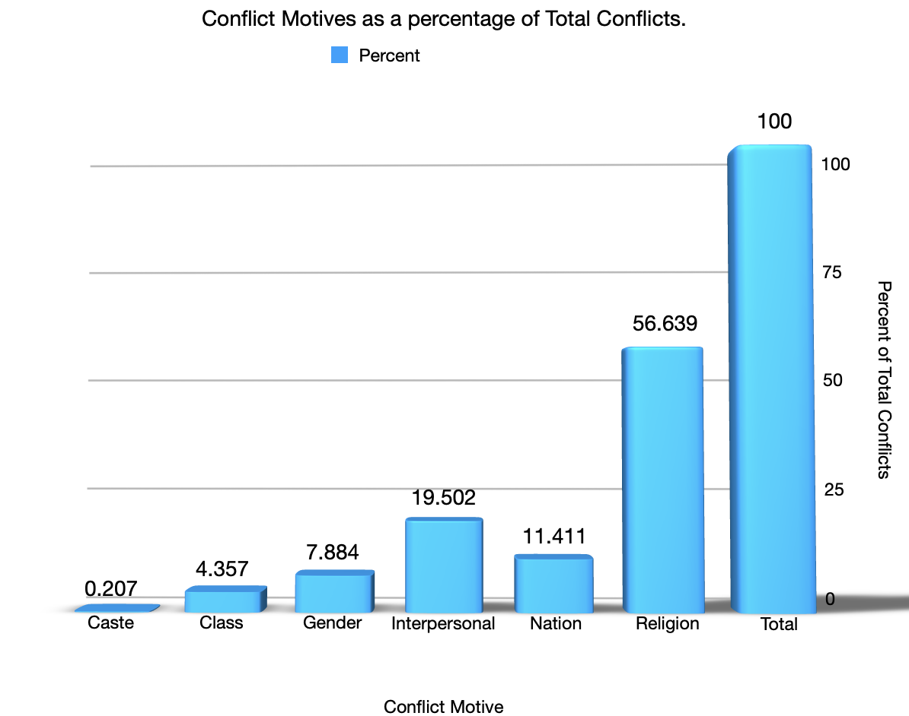

```{r setup, include=FALSE}
knitr::opts_chunk$set(echo = TRUE)
```

## Research Question

*How does religion affect the amount and nature of conflict one commits?*

The main point of this question is understanding the nuances of conflict with respect to religion in various forms. This study will explore both conflict that results in one’s death as well as conflict that does not. We will first have a look at different motives behind conflict and how a religious motive compares to others. This can give us an interesting look at how religion played a part in conflict during the partition. As it is likely that the followers of one religion may be much higher than others, expressing the acts of conflict as a % will give us a much clearer picture. A % > 100 may suggest members of a particular religion seem to be overly violent based on the data input on heurist.

## Operationalize into Queries

1. Using the facets search builder on heurist, we narrow down the events in which conflict took place (this can be of any kind) and what the motivation behind that was.

## Crosstab

#### 1. Conflict Type and Counts


## Analysis

1. As we can clearly see from the first chart, **Religion** seems to be the primary motivating factor behind acts of conflict. Counts of conflict arising due to religious reasons, account for a whopping 50+ percent of the total counts in the chart. That means that even if we summed all the other conflicts (for whatever reason), they would amount to lesser than that due to religion. Another interesting observation is that conflict motivated by **Nation** is the 3 largest cause. While both **Religion** and **Nation** have been listed as different types in the data, we must also keep in mind that the partition itself was primarily driven by **Religion**, indicating there may be some correlation. The same has been indicated in the data visualization below:

