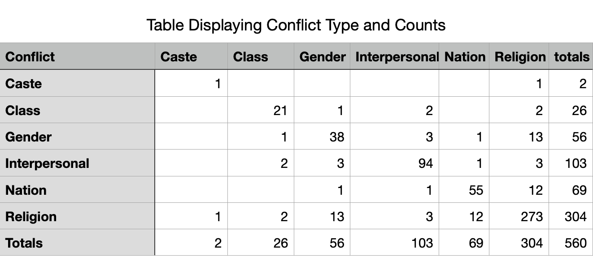
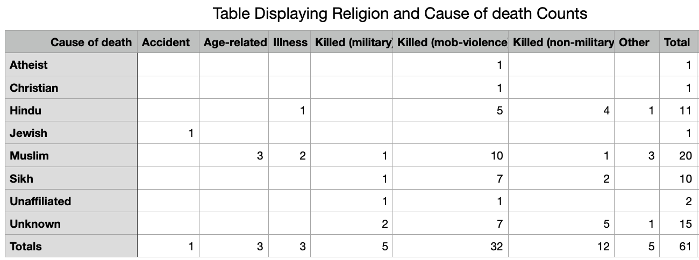
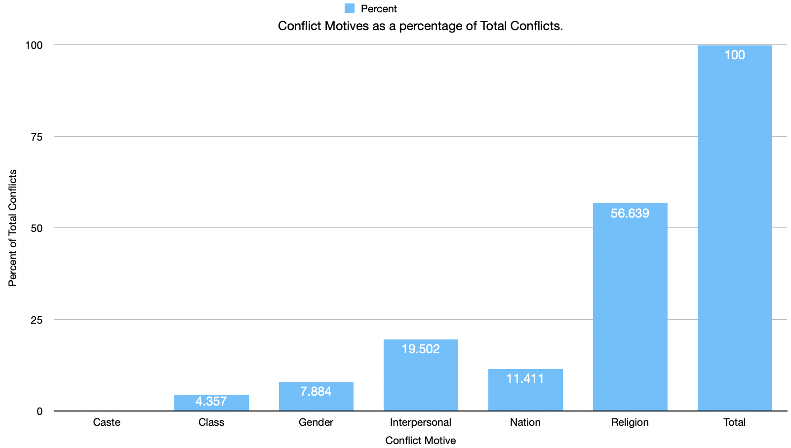
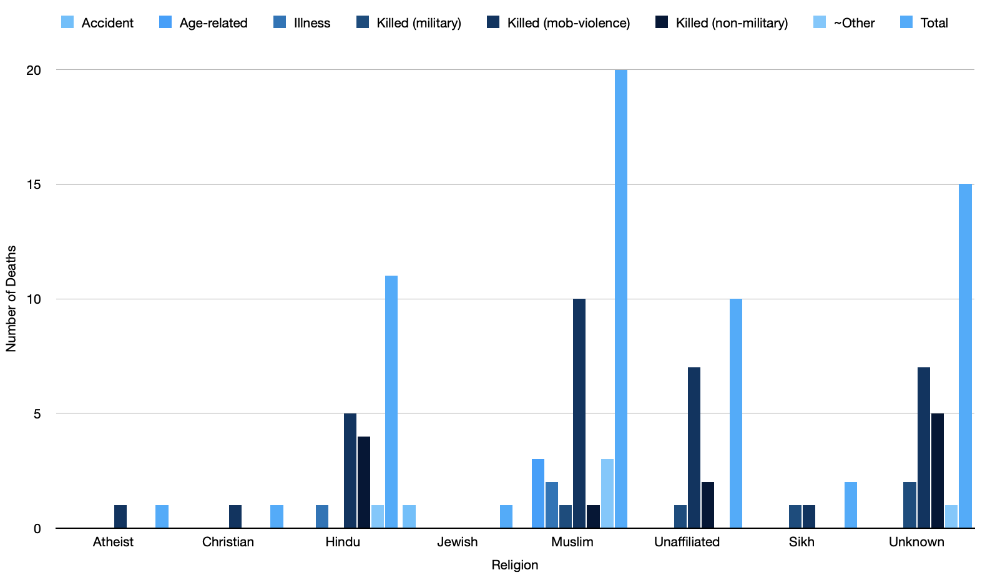
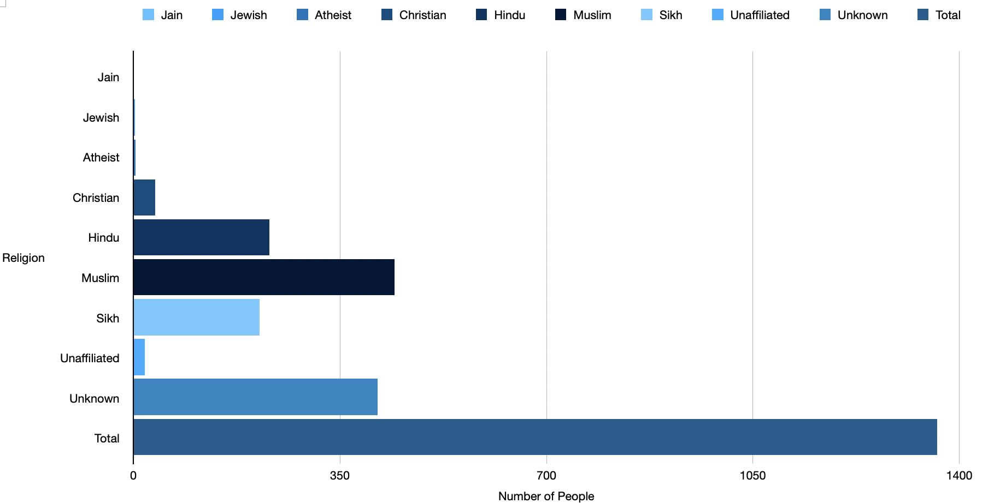
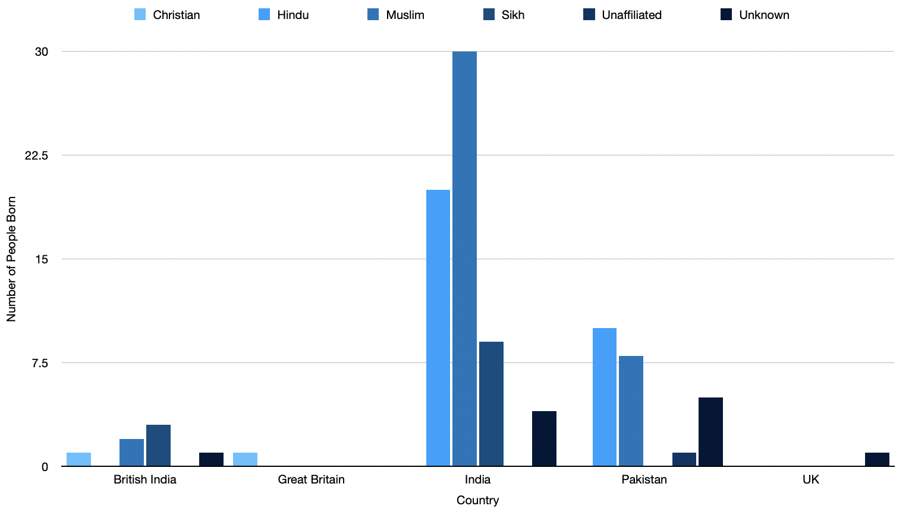
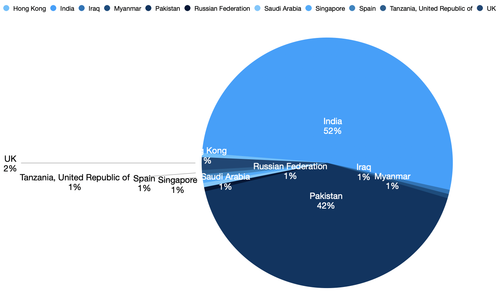

```{r setup, include=FALSE}
knitr::opts_chunk$set(echo = TRUE)
```

## Research Question

*How does religion affect the amount and nature of conflict one commits?*

The main point of this question is understanding the nuances of conflict with respect to religion in various forms. This study will explore both conflict that results in one’s death as well as conflict that does not. We will first have a look at different motives behind conflict and how a religious motive compares to others. This can give us an interesting look at how religion played a part in conflict during the partition. As it is likely that the followers of one religion may be much higher than others, expressing the acts of conflict as a % will give us a much clearer picture. A % > 100 may suggest members of a particular religion seem to be overly violent based on the data input on heurist.

## Operationalize into Queries

1. Using the facets search builder on heurist, we narrow down the events in which conflict took place (this can be of any kind) and what the motivation behind that was.

2. Using the same, we explore the cause of death of characters with respect to religion. This gives us a good birds eye view of how many members of a particular religion are dying and also the reason behind it. We can assess if members of a particular religion faced more persecution than others in our analysis.

## Crosstab

#### 1. Conflict Type and Counts

<center>

</center>
#### 2. Religion and Cause of Death Counts

<center>



</center>

## Analysis

1. As we can clearly see from the first chart, **Religion** seems to be the primary motivating factor behind acts of conflict. Counts of conflict arising due to religious reasons, account for a whopping 50+ percent of the total counts in the chart. That means that even if we summed all the other conflicts (for whatever reason), they would amount to lesser than that due to religion. Another interesting observation is that conflict motivated by **Nation** is the 3 largest cause. While both **Religion** and **Nation** have been listed as different types in the data, we must also keep in mind that the partition itself was primarily driven by **Religion**, indicating there may be some correlation. The same has been indicated in the data visualization below:

<center>



</center>

2. From the second chart, we can see that the number of deaths in most religions barring **Hindu**, **Muslim**, and **Sikh** is negligible. While this makes sense for Hindu's and Muslim's, as both of them form the majority of population in India (both divided as well as undivided), the high number of Sikh deaths may seem surprising. However, this is explained by the fact that a large percentage of people from the partition (Punjab, states belonged to the Sikh community.

<center>



</center>


3. 32.79% of the total deaths were **Muslims**. This is abnormally high, considering it is 80% higher than the number of **Hindu** deaths and 100% higher than the **Sikh** deaths. A reason for this could possibly be a higher **Muslim** population (we will inquire this thoroughly in the next analysis). 

<center>


</center>

4. As we can see in the above chart, the a lot of our suspicions were in fact, correct. The 80% higher number of **Muslim** deaths than **Hindus"** is explained by the 100% larger number of characters that it boasts. Surprisingly though, this brings into light that the proportion of **Hindu** deaths to its population is 1/4 higher than that of **Muslims**, suggesting they may have suffered more during the events of the partition. Of course, this could also be merely because of the events that have been included in the **data set**, but a 20% higher number definitely stands out. The way we come to this conclusion is that **Muslim** population accounts for 32.X% of the population, as well as 32.X% of total deaths, whereas **Hindu** population accounts for 16.X% of the total population and 19.X% of the total deaths. However, we should also investigate the country a person was born in (Pakistan/India), as that's more likely to give us a better picture since **Pakistan** predominantly has a **Muslim** population, whereas **India** has a **Hindu** one.

<center>


</center>

5. What's surprising is that the number of **Muslims** born in **India** is higher than that in **Pakistan**, and the number of **Hindus** born in **Pakistan** is higher than those born in **India**. This completely throws off our assumption that **Pakistan** would have more **Muslims**, and **India** would have a higher population of **Hindus**. Inquiring using the facet builder in heurist also does not seem to give us data using which we could accurately infer why this is, as our assumption is based on statistics that stand completely true in the concurrent. So far, nothing seems to have explained in definite numerical terms the higher death rate of **Hindus** as compared to **Muslims**. We can still however, explore the location of said events, as that could also give us a clue as to why that is.

<center>


</center>

6. Unfortunately, this also seems to be a dead end, since the number of events that take place in **India** are **25%** higher than those taking place in **Pakistan**. This again, does not explain the higher death rate of **Hindus**, as based on our previous data, we found that a higher number of **Hindus** were born in **Pakistan** as opposed to **India**. An alternate theory could also be that the higher number of **Hindu** deaths occur as they were trying to flee to **India**, and while the **event** took place in **India** they died. However, the data set does not have adequate data to prove this theory.

## Reflection

The process of data entry had **Pros** as well as **Cons**. As a member of a group (while entering the data), my responsibility was to read only **3** of the texts, extract characters, events, locations, etc. and enter the data systematically in heurist. Entering the data helped me get comfortable with heurist and poke around to understand the possibilities, which in turn aided the **Analysis** that I have conducted now. Moreover, it promoted the habit of looking at texts as data, extract quantitative information from it, and use it to infer and test hypothesis.

However, a major con would be that since I only read a small subset of all the texts that have been entered in the data set, I made assumptions about certain things that were found to not be true once I took a birds eye view of the data. This is perhaps because these one of events occurred only in some of the texts (which happened to be mine). This could be a major problem in any kind of inquiry, as it may plague the one's brain with **confirmation bias**.

One a personal note, I found this method of inquiry much better than that of **Voyant**, as one could quickly find definite answers to questions (or know that they cannot due to insufficient data), and then jump onto the next question to explore alternate theories. Moreover, the database has a much easier learning curve than **R** which makes it beginner friendly, which encourages one to get their hands dirty immediately as opposed to spending hours understanding different **R libraries** and its syntax. While I do understand **R** would definitely be a much better to tool to employ in larger studies, as the possibilities as limitless and one could create their own libraries as and when required, the ease of getting started with the **Heurist data set** definitely stimulated interest in me, because of which I spent much more time on this project out of sheer curiosity.

The data set does come with its fair share of limitations as well though. Most obviously, there no context at all surrounding any of the data present. For example, in the data surrounding one's deaths, there was no information about the **motive** behind or who the attacker was. This was one data point that affected this particular study, as understanding the (numerical) relation between which religions killed which ones could aid in proving its theories. Moreover, the fact that we could only zone in on fields of a particular kind at once (Events/Characters/Locations), made the scope of the relations we could draw rather limiting.

Another limitation would be understanding the environment in which events took place. As I had already read a subset of the texts present in the data base, I had a rough idea of what the study dealt with. But for someone who has not read any of the texts, drawing conclusions from merely the data could lead to several inaccurate theories.

What this data set excels incredibly at is giving a birds eye view of several statistics that can be easily quantified. This can aid someone in extracting larger inferences from the text, which can be very powerful.


